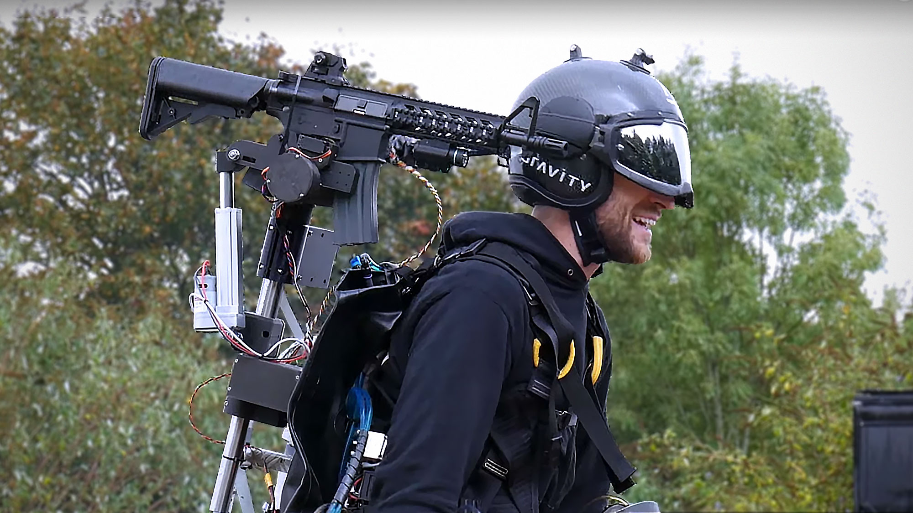
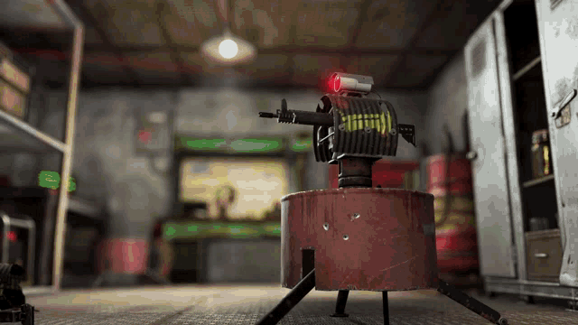
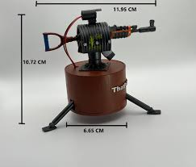
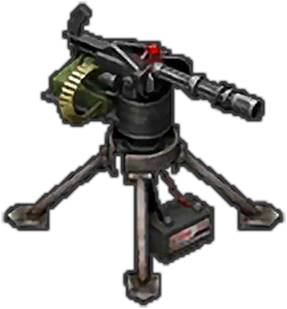

# ObjectDelivery-ProjectileBased-AutomaticTurret
This is a project that can be used in Drones to deliver drugs to hospitals or as a automatic military Artillery to delivery a shot or can be used in real life robotics to predict incoming objects and avoid them , this can comprise of object detection and depth mapping using computer vision and existing technology and custom trained models

This is inspired from the games such as RUST or Last Island of survival where the turrets attack you based on if youre a known user or not if not it attacks you , but this can have more applications in real world other than mercy-less killing. and its a very fun project to understand and apply computer vision and Basic mathematics and kinematics.

here are some images to depict the examples where the inspiration comes from :

# shoulder turret 

# inspirations from games:

